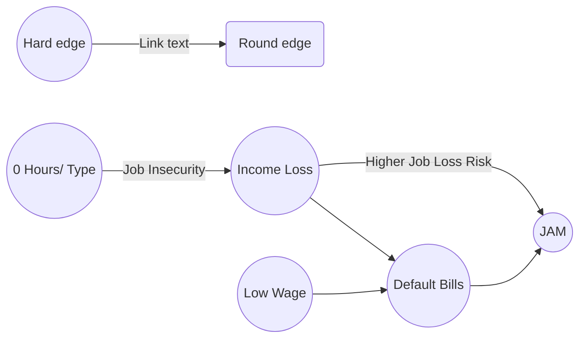

# What are JAMs?

[Just about managing](https://www.bbc.co.uk/news/uk-politics-38049245) is a term describing *low to middle income*’ group in the UK. 

- 6 million working-age households -  Families
- At least one person in work
- Not just about income (incl. dependents)
- Income topped up with welfare support
- Home ownership among the "just managing" fell from 59% in 1995 to 26% 2016
- Precarious job security: [left behind by globalisation](https://www.ft.com/content/84905054-ab2b-11e6-9cb3-bb8207902122)

## Resources

Report on JAMs with respect to Government Policy: [link](https://www.resolutionfoundation.org/publications/hanging-on-the-stresses-and-strains-of-britains-just-managing-families/)

Government [predictive analytics](https://troubledfamilies.blog.gov.uk/2018/05/14/predictive-analytics/) regarding vulnerable populations

Summary statistics of the daily Struggles for JAMs: [link](https://www.citizensadvice.org.uk/Global/CitizensAdvice/Work%20Publications/JustAboutManaging-final.pdf)

[JRF Blog](https://www.jrf.org.uk/blog/who-are-prime-minister-mays-just-about-managing-and-what-would-help-them) about JAMs, face many common challenges, including the cost of essentials such as housing and childcare, finding work with prospects that they can sustain and balancing work with caring responsibilities.

# Data Sources Relevant 

Council Tax - one of the first payments to stop

Thanos - use wifi websites in public libraries

Isaac - GraphDB to show connections with communities overlaid with census/contextual data

Transport data - can help public provision, car ownership, bus use by area

Imagery data - number of cars

House price data

Debts

Council houses - with affordability 

Road layout data/ housing style

Job Offering data (indeed scrape) - can see the wages/ types of contracts are on offer within a region

## Ella Interview

Hi Yus, so sorry for not having responded earlier. To be honest with you I've never worked on this type of thing before so I'm not entirely sure. Did some of my own research after you messaged me but I guess I can only offer the obvious (if I understand correctly what you're asking me) like benefit changes and issues, for example like the mass change from specific benefits to universal credit and how people can wait for over 6 weeks for their next payment when transitioning including people who are currently on employment support allowance (ESA) 'support group' because they are recognised to have mental health issues or other disabilities that deem them unable to be expected to work or work full time

So not only are these people expected to transition in time but they're also expected to be proactive (when they may have debilitating mental health issues), understand the complexities of universal credit (despite not even many people in the job centres fully understanding it because its so specific to each client and complicated) and then add everything to their journal (including scanning and uploading documents) when they a) may not have a computer and b) may not even know how to use a computer

So there's that

Also again I guess with mental health issues especially but also struggles with work etc comes lack of organisation regarding bills being paid etc. Council tax is a horrific example of something that can go from being manageable to completely extreme due to the seemingly immediate fines that can be put in place. Now if you're a parent who's working 18 hours a day to manage you're not always going to be able to be on top of paying your bills not just due to finances but also time, and the council tax fine is a hell of a lot in comparison to the individual monthly payments and can get people into a lot of debt (my house mate flo just did a paper on this - she works for citizens advice)

Again with mental health issues theirs also not knowing your employment rights for when you become unwell at work, not knowing how much sick pay you're entitled too etc which can put people behind/cause them more stress/cause them to be taken advantaged of/cause them to end up quitting their job and then falling behind in bills/payments

# Flo - Citizens Advice

Must define JAMs (they are different to vulnerable) - tax and income will give it a more defined definition

Get an idea of what policies they have in mind and what they can influence - council tax, social care child care

Check previous policies that will affect JAM i.e. energy bill and council tax

**Cliff edge** - people who are left out. Including provisions/ stipulations of who get's left out and acknowledge. Don't worry about it, just document it

Maybe can build a tool to test policy- test the impacts

| Data Set                       | Desc                                                         |      |
| ------------------------------ | ------------------------------------------------------------ | ---- |
| Family resource survey         | Income and benefit information collected by DWP - 20,000 households |      |
| Financial Difficulties Measure |                                                              |      |
| FCA financial health survey    |                                                              |      |
| Cost of Food                   | Family food                                                  |      |

# DAG

Directed Acyclic Graph, made up of observable and unobservable (latent) - may be good to use a hidden Markov model

## Biases

As described by [google](https://www.youtube.com/watch?v=59bMh59JQDo&feature=emb_title)

**Interaction Bias** The user biases an algorithm by the way we interact with it. A clear example of this bias is [Microsoft’s Tay](http://www.theverge.com/2016/3/24/11297050/tay-microsoft-chatbot-racist), a Twitter-based chatbot designed to learn from its interactions with users. Unfortunately, Tay was influenced by a user community that taught Tay to be racist and misogynistic. 

**Latent Bias** algorithm incorrectly correlates ideas with gender, race, sexuality, income, etc. This is the idea of correlating “doctor” with men, just because that's what stock imagery says

**Selection Bias**  introduced by the **selection** of individuals, groups or data for analysis in such a way that proper randomisation is not achieved, thereby ensuring that the sample obtained is not representative of the population intended to be analysed

# Outstanding Questions

What are the ethics of identifying a vulnerable group of people? - in built assumptions about JAMs could lead to problematic indicators

How is Minimum income standard calculated/ measured?

Reformat the slides - add jouster outputs to the slides

Add top emplyers

Identify employers by location

Add more causal demonstration

Add new scraped dataset

##Other Notes

Consequence Scanning - could be good to do to make the fellow aware 

[Private and Secure AI Library](https://towardsdatascience.com/private-ai-federated-learning-with-pysyft-and-pytorch-954a9e4a4d4e):

*One simple example of Federated Learning in the real world happens with Apple devices. The application QuickType (Apple's text prediction tool) actually uses models that are sent time to time to iOS devices via WiFi, are trained locally with users' data and are sent back to Apple's central server with their weights updated.*