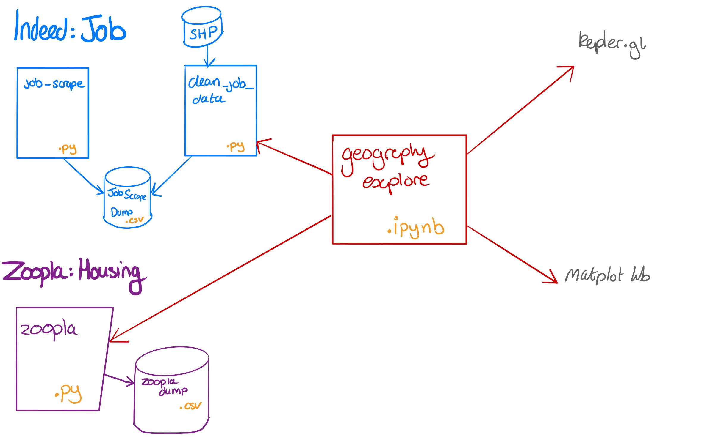

# Understanding JAMs

# Codebase
## Setup
### Using Virtual Enviroments
A good [primer](https://realpython.com/python-virtual-environments-a-primer/) on the uses of venv.

```bash
python3 -m venv venv # to create new venv in directory
source venv/bin/activate # to activate it
pip install -r requirements.txt
deactivate # to deactivate
```

### Using venv in Jupyter notebook
```bash
$ python -m venv projectname
$ source projectname/bin/activate
(venv) $ pip install ipykernel
(venv) $ ipython kernel install --user --name=projectname
```

## Runining the project
Then install requirements 

```bash
pip install -r requirements.txt
```



The `clean_job_data.py` file has a function `job_data_w_geog`which will start the scraping process (if no existing file) and return the results with geographic information

The `zoopla.py` file has a function `get_prop_ap` which will either call the api given the argument `use_api = True` for look for an existing data set.

## Visualisation

Quickest way to get the project started is running the `geography_explore.ipynb` notebook. Which will use the importers. 

Visualisation is done in a python notebook, some descriptive statistics using mapltot lib and a more interactive map utilising [kepler.gl](https://kepler.gl/) mapping tool.